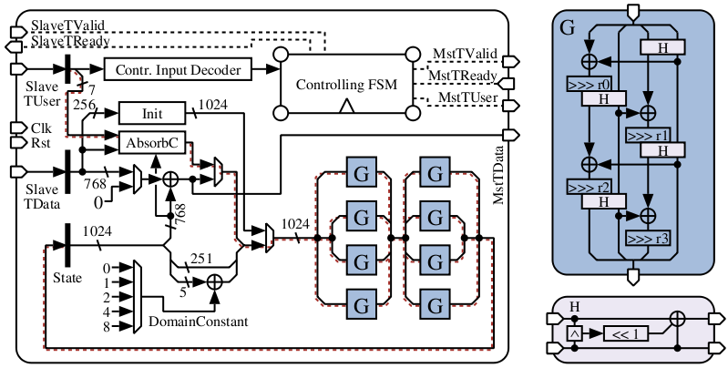

# NORX Hardware Reference Implementation

This is the reference hardware implementation of the authenticated encryption
cipher [NORX](https://norx.io/), which is a permutation-based candidate of the
[CAESAR](http://competitions.cr.yp.to/caesar.html) competition. The provided
architecture offers the functionality of NORX64-4-1, i.e., the recommended
version of the algorithm according to the
[second-round submission document](http://competitions.cr.yp.to/round2/norxv20.pdf).
The main goal of the design is to reach a throughput of 100Gbps targeting a 65nm
ASIC technology. The following figure shows a simplified overview of the
hardware architecture, which is mainly based on eight *G* functions and the
corresponding glue logic and controlling functionality around it. The design
supports both encryption as well as decryption modes, is coded in VHDL, and
communicates with its environment using two AXI4-Stream Protocol interfaces. The
design has been verified against the
[C reference implementation](https://github.com/norx/norx/tree/master/norx6441/ref)
as submitted to the second round of the CAESAR competition.

# Documentation

A brief documentation of the architecture can be found
[here](doc/out/norx-hw_doc.pdf).

# License

The VHDL code is released under the
[SOLDERPAD HARDWARE LICENSE v0.51](http://solderpad.org/licenses/SHL-0.51/). The
full license text is included in the LICENSE file.
